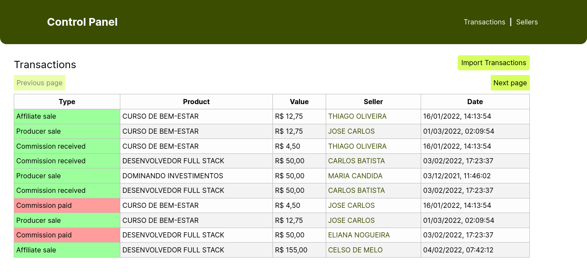
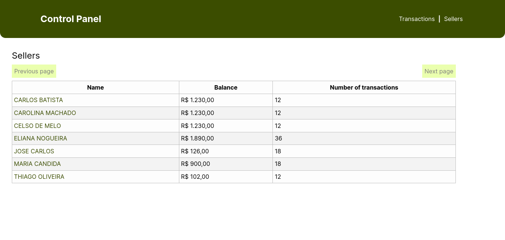
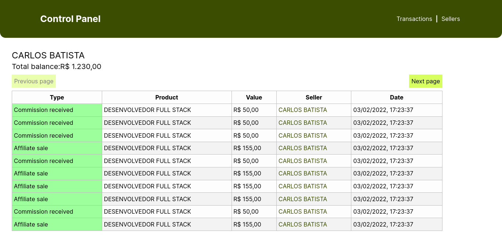

# Frontend of the challenge

## Responsabilities

Frontend responsibilities in this project are:

- Comunication with backend, returning transactions and sellers data, and uploading the sales file
- Provide a simple UI to the final user
- facilitate the access to the data

## Technologies

- NextJS 13.5.4
- React ^18
- Cypress "^13.3.1
- Typescript ^5
- Tailwind ^3

## Environment Variables

- `NEXT_PUBLIC_BACKEND_URL` - Backend URL, like `http://localhost:8000`

## Setup

### Docker

First, build the project preferably with [Docker BuildX](https://docs.docker.com/engine/reference/commandline/buildx/).

```
docker buildx build --tag frontend-challange-hubla .
```

If you can't use Docker BuildX, use the traditional build command.

```
docker build --tag frontend-challange-hubla .
```

And run with the backend database URL.

```
docker run -i -p 5000:5000 --env BACKEND_URL="[URL]" backend-challange-hubla
```

### NPM

You can also start with NPM:

> Default

```
npm run start
```

> Development

```
npm run dev
```

Development mode will only enable hot reload.

## Testing

> Unit tests

```
npx cypress run
```

> E2E Tests (and unit tests)

```
npm run cypress open
```

## Entities

### Seller

Seller represents a seller, which can be a producer or affiliate. The purpose of this entity is to keep a record of each seller's transactions, and calculate their current balance.

#### Properties

- `id` - The unique identifier of each seller. According to the information given in `sales.txt`, it is the name.
- `balance` - Current balance of the seller. This data is updated with each transaction involving the seller.
- `transactions` - A list representing the list of transactions involving the seller.

### Transaction

Transaction represents a producer/affiliate's transaction. This entity depends directly on the existence of the seller involving the transaction. All data is taken from the file `sales.txt`.

### Properties

- `id` – The unique identifier of each transaction. It's a random ID in uuid4.
- `type` - Transaction type, ranging from 1 to 4.
- `date` - Transaction date
- `product` - Name of the product involving the transaction.
- `value` - Financial cost of the product.
- `sellerId` - ID of the product seller, which may be the producer/affiliate.

## Pages

### /

- Show transactions list
- Import sales file



### /seller

- Show seller list with transactions counter



### /seller/:id

- Show transactions list of a seller
- Show total balance of a seller

